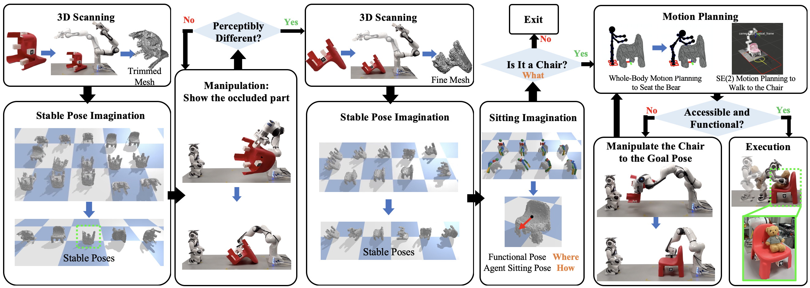

# Prepare the Chair for the Bear!

## Authors
[Xin Meng](https://github.com/XinnMeng), [Hongtao Wu](https://github.com/hongtaowu67), [Sipu Ruan](https://ruansp.github.io/), [Gregory Chirikjian](https://cde.nus.edu.sg/me/staff/chirikjian-gregory-s/)

Department of Mechanical Engineering, National University of Singapore

Laboratory for Computational and Sensing Robotics (LCSR), Johns Hopkins University

## Abstract
In this letter, a paradigm for the classification and manipulation of previously unseen objects is established and demonstrated through a real example of chairs. We present a novel robot manipulation method, guided by the understanding of object stability, perceptibility, and affordance, which allows the robot to prepare previously unseen and randomly oriented chairs for a teddy bear to sit on. Specifically, the robot encounters an unknown object and first reconstructs a complete 3D model from perceptual data via active and autonomous manipulation. By inserting this model into a physical simulator (*i.e.*, the robot's "imagination"), the robot assesses whether the object is a chair and determines how to reorient it properly to be used, *i.e.*, how to reorient it to an upright and accessible pose. If the object is classified as a chair, the robot reorients the object to this pose and seat the teddy bear onto the chair. The teddy bear is a proxy for an elderly person, hospital patient, or child. Experiment results show that our method achieves a high success rate on the real robot task of chair preparation. Also, it outperforms several baseline methods on the task of upright pose prediction for chairs.

## Links
- Arxiv
- [Appendix](https://drive.google.com/file/d/1tBryc_sg1pX8GOdvHWhrMP5mv4lRa-wc/view?usp=sharing)
- [Video](https://youtu.be/33z_6hgmZaI)
- Code and data will be available

## Introductory Video
<iframe width="640" height="360" src="https://www.youtube.com/embed/33z_6hgmZaI" frameborder="0" allow="autoplay; encrypted-media" allowfullscreen></iframe>
